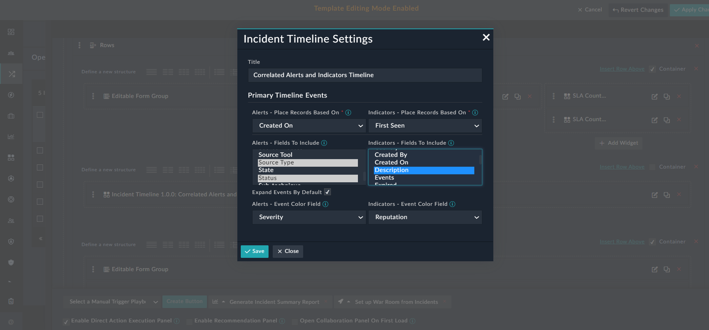
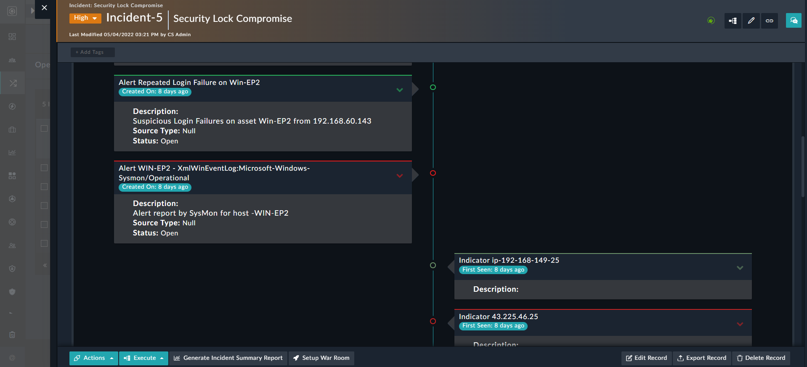

| [Home](../README.md) |
|----------------------|

# Usage

The **Incident Timeline** widget displays a vertical timeline showing correlations, alerts, and indicators of an incident record sorted on user-selectable date fields. 

You can add this widget to the view panel of an incident record to view a vertical timeline of the alerts and indicators related to that incident record. The timeline entries are sorted using the date fields, such as Created On, First Seen, Modified On, etc., which are selected by the user.

1. Edit an alert's view template and select **Add Widget** button.

2. Select **Incident Timeline**, under the *Widget Library* section, to bring up the **Incident Timeline Settings** modal.

3. Specify the title of the incident timeline in the **Title** field.

4. Select an option (e.g. *Created On*) for the **Alerts - Place Records Based On** field.

5. Select an option (e.g. *First Seen*) for the **Indicators - Place Records Based On** field.

6. Select the fields to include under the **Alerts - Fields to Include** field. You can select multiple fields.

7. Select the fields to include under the **Indicators - Fields to Include** field. You can select multiple fields.

8. To expand the **Expand Events By Default** checkbox to expand the indicators' and alerts' data cards, by default, in the timeline.

9. Select an option for the **Alerts - Event Color Field** field. If the selected field's options contain defined color codes, the data cards' are highlighted using the selected value's colors. For example, if you select **Severity** and it has defined color codes for its options, the data cards' are highlighted with the severity color that is set for that correlated alert, i.e., the data card of an alert whose severity is set to *Critical* is highlighted in *red*.

10. Select an option for the **Indicators - Event Color Field** field. If the selected field's options contain defined color codes, the data cards' are highlighted using the selected value's colors. For example, if you select **Reputation** and it has defined color codes for its options, the data cards' are highlighted with the reputation color that is set for that correlated incident, i.e., the data card of an incident whose severity is set to *No Reputation Available* is highlighted in *light green*.

Following sections display the edit view and the timeline graph using example values.

## Incident Timeline Edit View

## Incident Timeline Graph

## Next Steps

| [Installation](./setup.md#installation) | [Configuration](./setup.md#configuration) |
|-----------------------------------------|-------------------------------------------|
